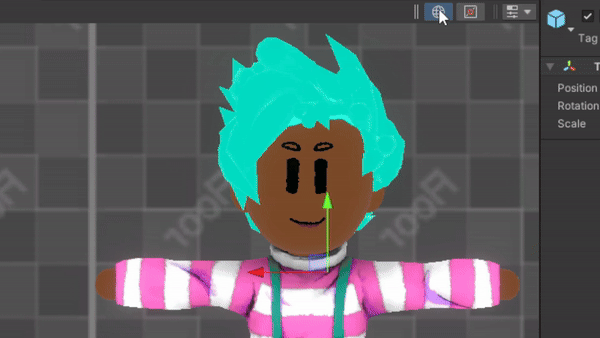
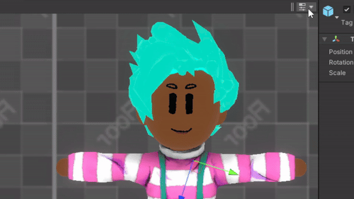

# Reasonable Pivots
A toolbar script for the Unity Editor that restores the most sensible version of the Pivot toggles in the Scene View.

## Example
The Reasonable Pivots implementation of pivot toggles:

The official implementation of pivot toggles as of Unity 2021.3.31f1:

## Installation
Click the green Code button, download the .zip, and drag `ReasonablePivots.cs` into any folder named `Editor` in your Unity project. Once installed, navigate to your Scene View and click the three dots in the top right, then navigate to Overlays > Reasonable Pivots. Upon clicking the Reasonable Pivots tab, the new toolbar will appear.